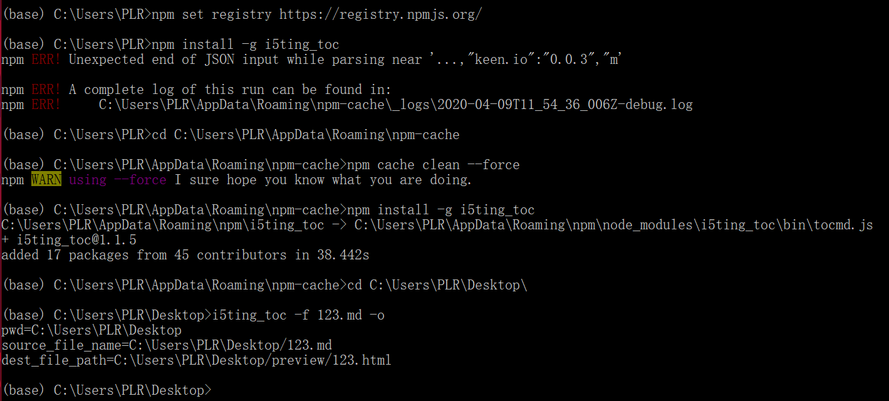

<!--
author: thyme
date: 2020-04-09
title: 解决npmERR!
tags: 
category: 
status:  
summary: node.js
-->


# [解决npm ERR! Unexpected end of JSON input while parsing near的方法汇总]

[javascript](https://segmentfault.com/t/javascript)[node.js](https://segmentfault.com/t/node.js)


这两天执行 npm install 时会报错误：

```
npm ERR! Unexpected end of JSON input while parsing near
```

这个错误的解决方法有以下几种：

**1.删掉package.lock.json**

**2.清除cache**

```
npm cache clean --force
```

**3.进入下面这个文件夹清除cache**
路径：C:/Users/PC/AppData/Roaming/npm-cache
执行：

```
npm cache clean --force
```

**4.不要用淘宝镜像。**

```
npm set registry https://registry.npmjs.org/
```

亲测好用



> [**一个互联网学徒**](https://segmentfault.com/u/yigehulianwangxuetu)
>
> 来源： https://segmentfault.com/a/1190000015646531 